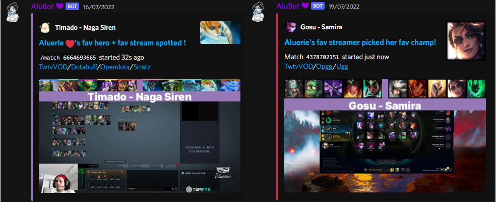

## AluBot 💜

Initial idea was to send me notifications  when my favourite  Dota 2/ League of Legends 
[twitch.tv](https://www.twitch.tv/) streamers pick my favourite heroes/champions.

However, the whole process grew into making *the ultimate multipurpose bot*
with pretty much everything I ever needed ! Check List of features after the pic.

## ReadMe Contents

1. [📖 Features](#features) 
2. [🏠 Wiki](https://github.com/Aluerie/AluBot/wiki) - link to github wiki page, most notably:
    * [🛠️ Running/Installation guide](https://github.com/Aluerie/AluBot/wiki/%F0%9F%9B%A0%EF%B8%8FRunning-Installation-guide)
    * [🕵️ Privacy Policy and Terms of Service](https://github.com/Aluerie/AluBot/wiki/%F0%9F%95%B5%EF%B8%8F--Privacy-Policy-and-Terms-of-Service)
3. [🤝 Reporting Bugs, Making Suggestions and Contributing](#-reporting-bugs-making-suggestions-and-contributing)
4. [🤗 Thanks](#-thanks)

---

### 📖 Features

All info in `/help` and `/setup` commands of the bot. But here is list that is probably not full:
 - [X] maintains #🍋dota2_news
   * [Dota 2 Bugtracker](https://github.com/ValveSoftware/Dota2-Gameplay) updates - comments from Valve employees  
   * Steam DB's [GameTracking-Dota2](https://github.com/SteamDatabase/GameTracking-Dota2) updates and its analysis
   * Twitter, Reddit comments/posts from known accounts
 - [X] #🔬lol_news announcement channel
 - [X] TextToSpeech
 - [X] Confessions
 - [X] Birthday role and congratulations 
 - [X] Moderation
 - [X] Twitch starting stream notifications
 - [X] Timers
 - [X] Welcome messages
 - [X] Logging
 - [X] Emote stats
 - [X] Info commands
 - [X] WolframAlpha queries commands
 - [X] Tags system 
 - [X] Google translate messages
 - [X] Suggestion commands
 - [X] Wordcloud
 - [X] ToDo list
 - [X] Reminders 
 - [X] AFK/Self-mute commands
 - [X] NSFW 
 - [X] Schedule for Dota 2 matches
 - [X] Stalking my Dota 2 profile (despite my "Expose data" setting is off)
 - [X] So in total Over 100 useful/fun commands.
 - [X] And so much more to come.

### 🤝 Reporting Bugs, Making Suggestions and Contributing

* There are [Contributing guidelines](https://github.com/Aluerie/AluBot/blob/main/.github/CONTRIBUTING.md)
* TL;DR^: Feel free to
  * open a GitHub Issue/PR/Discussion
  * use `/feedback` bot command 
  * write [Aluerie ❤#6524](https://discordapp.com/users/312204139751014400) on discord
  * look my [Project](https://github.com/users/Aluerie/projects/8/views/1) for ideas to contribute.

### 🤗 Thanks 
Thanks to everybody who has ever helped me with the bot in any way or form. 

Special thanks to the whole `discord.py` community for endless amount of educational value.

