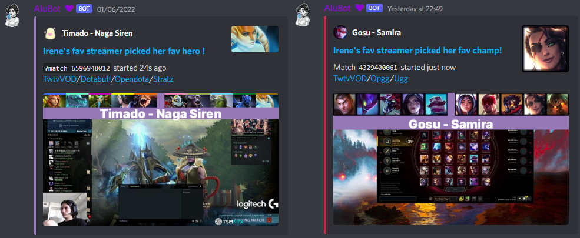

## AluBot

A personal Discord bot.

---

### Description
Initial idea was to send me notifications 
when my favourite Dota 2/ League of Legends [twitch.tv](https://www.twitch.tv/) streamers pick my favourite heroes/champions.

However, the whole process grew into making the ultimate multipurpose bot 
with pretty much everything I ever needed ! 

### Follow us

* The server with the bot: [Invite link](https://discord.gg/K8FuDeP)
* The server is just a small community of [mine](https://www.twitch.tv/Aluerie)

### Reporting Bugs and Making Suggestions

* Feel free to make an issue [here](https://github.com/Aluerie/AluBot/issues/new) or write me on discord.

### Running

This bot is written under assumption of it being **only on my servers** so neither inviting it/running 
your instance of the bot will work well. And I'm honestly not a very good programmer. Nevertheless, 
1. Python `3.10` or higher is required
2. Set up venv `python3.10 -m venv venv`
3. Install dependencies `pip install -U -r requirements.txt`
4. Rename `env.env.example` to `env.env` and fill out all needed config parameters and setup your PostgreSQL
5. Replace variables in `./utils/var.py` with your own values
6. Run the bot with `py main.py -n NAME` where NAME is `alu` for AluBot or `yen` for YenBot, test version of former
7. if it is Yennifer then change `test_list` in `./utils/mybot.py` to include cogs you want to test
