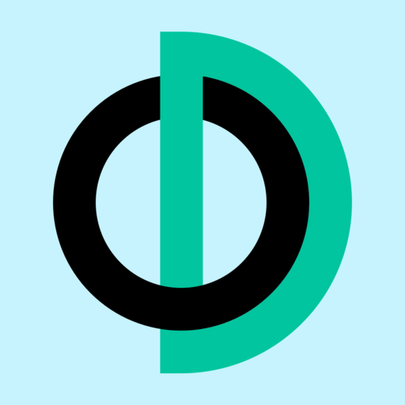

# AluBot 💜

Initial idea was to send me notifications when my favourite  Dota 2/ League of Legends
[twitch.tv](https://www.twitch.tv/) streamers pick my favourite heroes/champions and as games end edit the messages to include post-game information.

However, the whole process grew into making *the ultimate multipurpose bot*
with pretty much everything I ever needed ! Check List of features after the pic.

## 🏓Table of Contents

- [AluBot 💜](#alubot-)
    - [🏓Table of Contents](#table-of-contents)
    - [🏠 Wiki](#-wiki)
    - [📖 Features](#-features)
    - [🤝 Reporting Bugs, Making Suggestions and Contributing](#-reporting-bugs-making-suggestions-and-contributing)
    - [🤗 Thanks](#-thanks)
    - [🚀 Powered by](#-powered-by)
    - [TODO: finish the table](#todo-finish-the-table)

## 🏠 [Wiki](<https://github.com/Aluerie/AluBot/wiki>)

I put a lot of information into GitHub [🏠 Wiki](https://github.com/Aluerie/AluBot/wiki) - so go check it out. Including:

- [🛠️ Running/Installation guide](https://github.com/Aluerie/AluBot/wiki/%F0%9F%9B%A0%EF%B8%8FRunning-Installation-guide)
- [🕵️ Privacy Policy](https://github.com/Aluerie/AluBot/wiki/%F0%9F%95%B5%EF%B8%8F--Privacy-Policy)
- [🖊️ Terms of Service](https://github.com/Aluerie/AluBot/wiki/%F0%9F%96%8A%EF%B8%8F-Terms-of-Service)
- [🔬 GitHub stats for the project](https://github.com/Aluerie/AluBot/wiki/%F0%9F%94%AC-GitHub-stats-for-the-project)
- [🚓 Credits, Licence, Copyright](https://github.com/Aluerie/AluBot/wiki/%F0%9F%9A%93-Credits,-Licence,-Copyright)

## 📖 Features

All info in `/help` command of the bot. The following list is far from being complete, but still (#TODO: update the list):

- [X] FPC (Favourite Player+Character) Notifications

    Sends you notifications when your <ins>F</ins>avourite <ins>P</ins>layers pick your favourite <ins>C</ins>haracters
    (thus FPC abbreviation). Also edits messages to include post-game stats.

    The following games are currently supported:
    - Dota 2
    - League Of Legends
- [X] maintains Game News  announcement channels
    - `#🐈bugtracker_news` tracks when Valve developers interact with the [Dota 2 Bugtracker](https://github.com/ValveSoftware/Dota2-Gameplay).
    - `#🍋dota2_news with` Official [Dota 2](https://www.dota2.com/home) news
- [X] Fix bad links in discord chat with Mimic™️ (just a feature name) technology. Currently fixes:
    - Twitter links with the help of [fxtwitter.com](https://github.com/FixTweet/FixTweet)
    - Instagram with [ddinstagram.com](https://ddinstagram.com/)
- [X] In total over 100 useful/fun commands.
- [X] And so much more (and even more to come).
  
---

- [X] TextToSpeech
- [X] Confessions
- [X] Birthday role and congratulations
- [X] Moderation
- [X] Twitch starting stream notifications
- [X] Timers
- [X] Welcome messages
- [X] Logging
- [X] Emote stats
- [X] Info commands
- [X] WolframAlpha queries commands
- [X] Tags system
- [X] Google translate messages
- [X] Suggestion commands
- [X] Wordcloud
- [X] ToDo list
- [X] Reminders
- [X] AFK/Self-mute commands
- [X] NSFW
- [X] Schedule for Dota 2 matches
- [X] Stalking my Dota 2 profile (despite my "Expose data" setting is off)

## 🤝 Reporting Bugs, Making Suggestions and Contributing

- There are [Contributing guidelines](/.github/CONTRIBUTING.md)
- TL;DR^: Feel free to
    - open a GitHub Issue/PR
    - use `/feedback` bot command
    - write [@aluerie](https://discordapp.com/users/312204139751014400) on discord
    - look [Project](https://github.com/users/Aluerie/projects/8/views/1) for ideas to contribute.
    - join our [discord server](https://discord.gg/K8FuDeP) (it's just a server of mine though, not some "official alubot support")

## 🤗 Thanks

Thanks to everybody who has ever helped me with the bot in any way or form.

Special thanks to the whole `discord.py` community for endless amount of educational value.

## 🚀 Powered by

<table>
    <tr>
        <th style="text-align: center;">Site</th>
        <th style="text-align: center;">API Docs</th>
        <th style="text-align: center;">Repo</th>
        <th style="text-align: center;">Library/Wrapper Docs</th>
    </tr>
    <tr>
        <td>
            
        </td>
        <td>
            <a href="https://discord.com/developers/docs/intro">Discord Bot API</a>
        </td>
        <td>
            
        </td>
        <td>
            <a href="https://discordpy.readthedocs.io/en/latest/">discord.py</a>
        </td>
    </tr>
    <tr>
        <td>
            
        </td>
        <td>Dota 2 Game Coordinator  API</td>
        <td>
            
        </td>
        <td><a href="https://dota2.readthedocs.io/en/stable/">dota2</a>
        (soon™️ to be replaced with <a href="https://steam-py.github.io/docs/latest/">steam.py</a>)</td>
    </tr>
    <tr>
        <td>
            
        </td>
        <td><a href="https://api.stratz.com/graphiql/">Stratz GraphQL API</a></td>
        <td style="text-align: center;">
        —
        </td>
        <td>Just aiohttp requests</a></td>
    </tr>
    <tr>
        <td>
            
        </td>
        <td><a href="https://docs.opendota.com/">OpenDota API</a></td>
        <td style="text-align: center;">
        —
        </td>
        <td>pulsefire-like client (see below)</a></td>
    </tr>
    <tr>
        <td>
            
        </td>
        <td><a href="https://developer.riotgames.com/apis">Riot Games API</a></td>
        <td>
            
        </td>
        <td><a href="https://pulsefire.iann838.com/">pulsefire</a></td>
    </tr>
    <tr>
        <td>
            
        </td>
        <td>
            <a href="https://twitchio.dev/en/stable/">Twitch API</a>
        </td>
    </tr>
</table>

## TODO: finish the table
  
- Github rest api
- steam web api
- wolfram api
